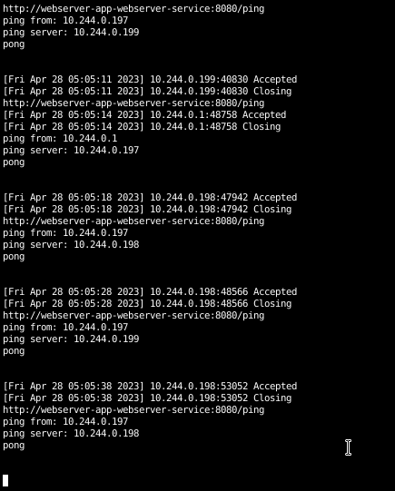

# WebServer Operator

## Overview

Using [Ansible Based Operator SDK](https://sdk.operatorframework.io/docs/building-operators/ansible/) to create a WebServer Operator.

- Using a CRD to create a WebServer Deployment with a number of replicas and a service of ClusterIP type.
- There is a spec called `TARGET_ENDPOINTS` which is a list of endpoints to ping and is being used as environment variable in the deployment.
- Deployment and Service are present in `./roles/webserver-app/tasks/`

## Build & Deploy

- Update `VERSION` and `IMAGE_TAG_BASE` in Makefile 
- Add spec to `./config/samples/ws_v1alpha1_webserver.yaml`
- Run:

```sh
make docker-build docker-push && \
make deploy && \
./bin/kustomize build ./config/samples/ | kubectl apply -f -
```
## Undeploy

```sh
./bin/kustomize build ./config/samples/ | kubectl delete -f - && \
make undeploy
```

## Guide
- Patching a CRD to change the size of the deployment

```sh
kubectl patch webserver webserver-app -p '{"spec":{"size": 2}}' --type=merge
```

- To see logs of http servers, including the response of ping requests
```sh
kubectl logs -f deploy/webserver-app-webserver
```



## Further Improvements

- Add a spec to the CRD to specify the type of service (ClusterIP, NodePort, LoadBalancer)
- Add health checks to the deployment
- Restrict role permissions based on requirements